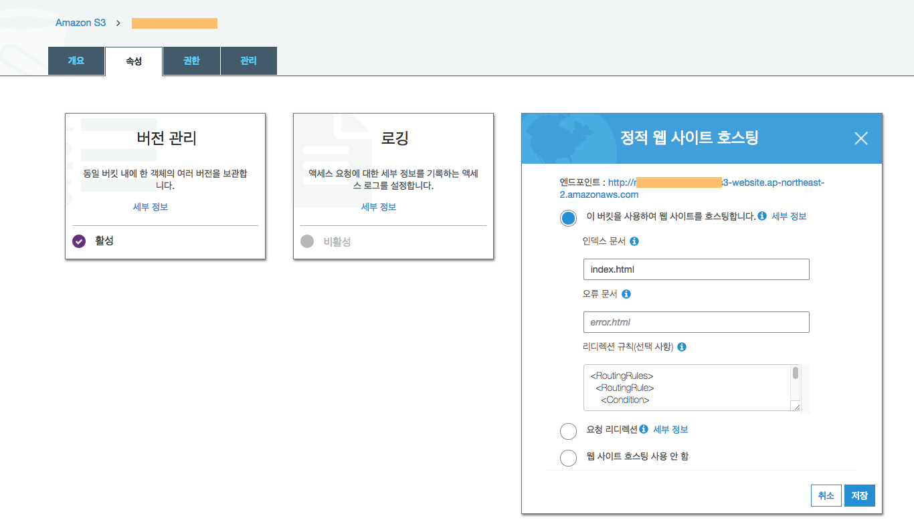
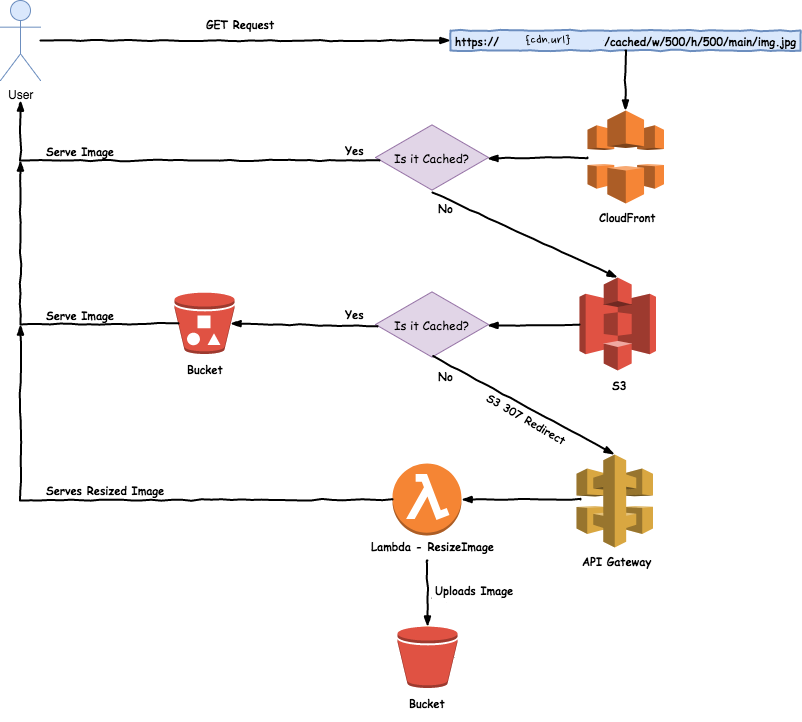

# image-optimizer
[](https://travis-ci.org/ridi/image-optimizer)
asdfas

## Requirement

1. AWS Resource (S3, CDN, Lambda, ApiGateway)
2. User with permissions such as s3, iam, cloudformation, lambda and apigateway

## How to run

1. Create environment file `serverless.env.yml` with the following content:
```yaml
---

dev:
  DEPLOYMENT_BUCKET: {BUCKET_NAME}
  CONFIG: {CONFIG_FILE_NAME} 
  SENTRY_DSN: {YOUR_SERNTRY_DNS}

production:
  DEPLOYMENT_BUCKET: {BUCKET_NAME}
  CONFIG: {CONFIG_FILE_NAME} 
  SENTRY_DSN: {YOUR_SENTRY_DNS} 
```

2. Create a config file, `config.{stage}.json` with the following content:
```javascript
{
    "BUCKET_NAME": "{BUCKET}",
    "FILE_CACHE_AGE": {CACHE_AGE},
    "CDN": "{CDN}",
    "DEFAULT_QUALITY": 82, // default optimize quality
    "DEFAULT_PATH": "{CACHE_PATH_IN_BUCKET}" // cache path
}
```

3. Run command `make deploy-dev` or `make deploy-production`

4. Set redirect link to s3

```xml
<RoutingRules>
  <RoutingRule>
    <Condition>
    <HttpErrorCodeReturnedEquals>403</HttpErrorCodeReturnedEquals>
    </Condition>
    <Redirect>
      <Protocol>https</Protocol>
      <HostName>{gateway}.execute-api.ap-northeast-2.amazonaws.com</HostName>
      <ReplaceKeyPrefixWith>{stage}/</ReplaceKeyPrefixWith>
      <HttpRedirectCode>307</HttpRedirectCode>
    </Redirect>
  </RoutingRule>
</RoutingRules>
```

## Architecture


## How to use
  Send a GET request to https://xxx.cloudfront.net/cached/w/300/q/75/banner-images/main/quin.jpg

  "https://xxx.cloudfront.net/" is the CDN address which will ask for the image in your S3 bucket with this path: "cached/w/300/q/75/banner-images/main/quin.jpg"

  You can give 4 options at the moment:
  - s : size (Requires both width and height to be given)
  - w : width (Cannot use together with size parameter)
  - h : height (Cannot use together with size parameter)
  - q : quality

## References
  1. https://stackoverflow.com/questions/42308291/resize-images-on-the-fly-in-cloudfront-and-get-them-in-the-same-url-instantly-a
  2. https://medium.com/dev-cubica/resizing-images-on-the-fly-with-aws-4bb75371e795

